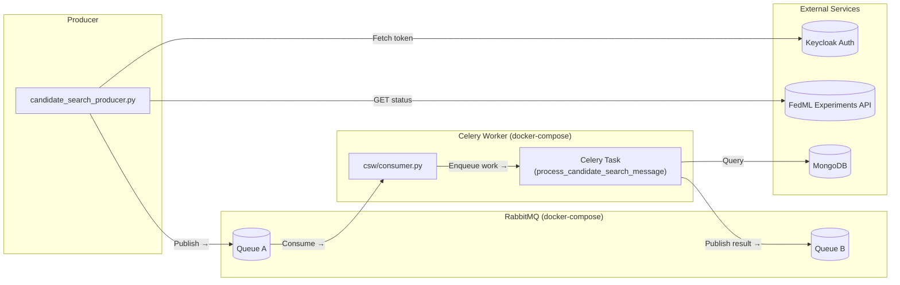

# PPFL Python Worker

A Python-based worker service designed to process candidate search messages using RabbitMQ and MongoDB. The service consumes messages from a RabbitMQ queue, verifies fingerprint IDs in a MongoDB collection, and publishes the results to a second queue. This worker is part of a larger system designed to handle candidate search operations in a distributed architecture.

---

## Table of Contents

- [Overview](#overview)
- [Features](#features)
- [Architecture](#architecture)
- [Requirements](#requirements)
- [Installation & Setup](#installation--setup)
- [Running the Service](#running-the-service)
- [Environment Configuration](#environment-configuration)
- [Troubleshooting](#troubleshooting)
- [Additional Information](#additional-information)

---

## Overview

The PPFL Python Worker is a microservice that integrates with RabbitMQ and MongoDB. Its primary function is to:
1. **Consume messages:** Listen on a designated RabbitMQ queue (Queue A) for candidate search results.
2. **Process fingerprints:** Extract fingerprint IDs from the received JSON messages and verify them against a MongoDB collection.
3. **Publish results:** Depending on the verification (whether all fingerprints exist in the database), publish a result message with a status of either `"verified"` or `"partial"` to another RabbitMQ queue (Queue B).

This design allows for asynchronous processing and reliable message handling in a distributed system.

---

## Features

- **RabbitMQ Integration:**  
  - Uses `pika` for interacting with RabbitMQ.
  - Supports both message consumption (via a consumer script) and message production (via a producer script).
  - Employs durable queues to ensure message persistence.

- **MongoDB Integration:**  
  - Connects to a MongoDB instance (expected to run on port `37017`).
  - Verifies fingerprint documents by matching candidate search fingerprint IDs with the `_id` field in MongoDB.
  
- **Task Queue with Celery:**  
  - Utilizes Celery to run tasks asynchronously.
  - Allows for scalable, distributed message processing.
  
- **Environment Management:**  
  - Uses `python-dotenv` for environment variable management.
  - Simplifies configuration across development and production environments.

- **Containerization with Docker Compose:**  
  - Provides a Docker Compose setup to run RabbitMQ in a container.
  - Although MongoDB is expected to run on the host, the worker can be containerized, ensuring consistent deployment.

---

## Architecture

The project is composed of the following components:

- **Candidate Search Producer:** Publishes candidate search status messages (with fingerprint IDs) to RabbitMQ (Queue A).
- **RabbitMQ Message Broker:** Manages Queue A (incoming) and Queue B (results), running in Docker.
- **Consumer & Worker:** Consumes messages from Queue A, processes them via Celery tasks, queries MongoDB for verification, and publishes results to Queue B.
- **MongoDB:** Stores fingerprint documents indexed by `_id` for quick lookup.

### Architecture Diagram

---

## Requirements

- **Python:** 3.11 or higher
- **MongoDB:** Running on the host on port `37017`
- **RabbitMQ:** Provided via Docker Compose (or another deployment)
- **Docker and Docker Compose:** For containerizing and managing RabbitMQ (and optionally the worker)
- **Poetry:** For dependency management

**Python Dependencies:**
- `pika` (^1.3.2)
- `python-dotenv` (^1.0.1)
- `pymongo` (^4.11.3)
- `celery` (^5.2.7)
- `requests` (^2.31.0)

---

<!-- Rest of README unchanged -->